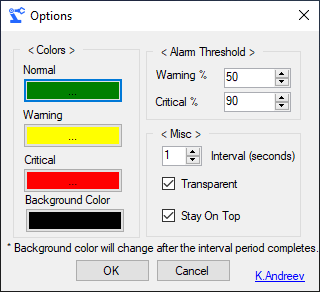

# CPU Gadget

**CPU Gadget** is a small .NET utility program that checks the CPU usage at a regular interval and displays it in a transparent window on the screen. 

# Usage 

There are 4 controls on the right, from to bottom they are:
* Close - it closes the program permantently
* Minimize - it minimizes the program in the tray
* Options - it opens up a new windows where you can adjust some options
* Touch - drag and drop the gadget around the screen to move

The numbers at the bottom present 1/10th of the current CPU usage, e.g. 2 means 20% CPU utilization.

# Options

You can change the colors for the normal, warning and critical thresholds as well as the background color. 
You can also change the transparency and the warning and critical threshold value. For example, you can change the critical threshold to be 99% and the you'll see the critical color (red) only when the CPU is at 99% usage.

# Download

You can compile on your own using Visual Studio and .NET 4.5 or download the binary from the releases.

